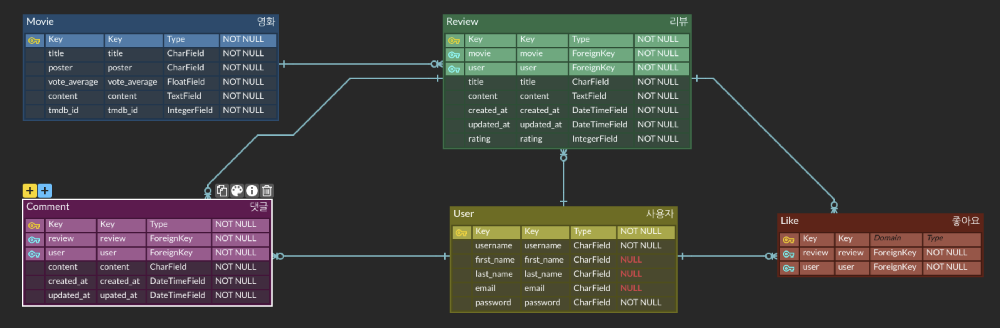
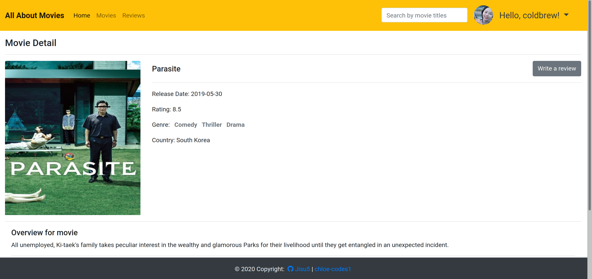
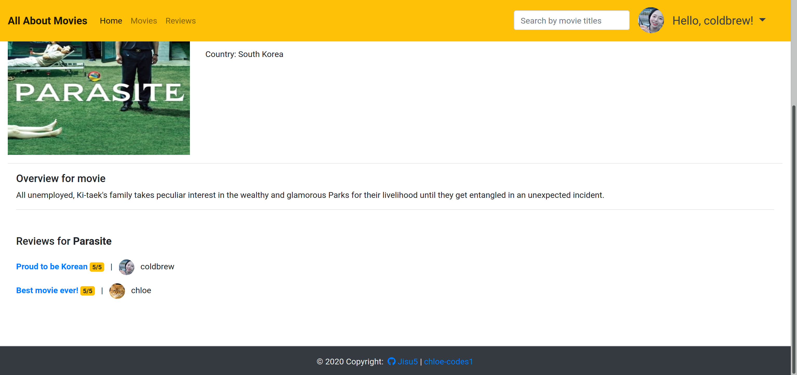
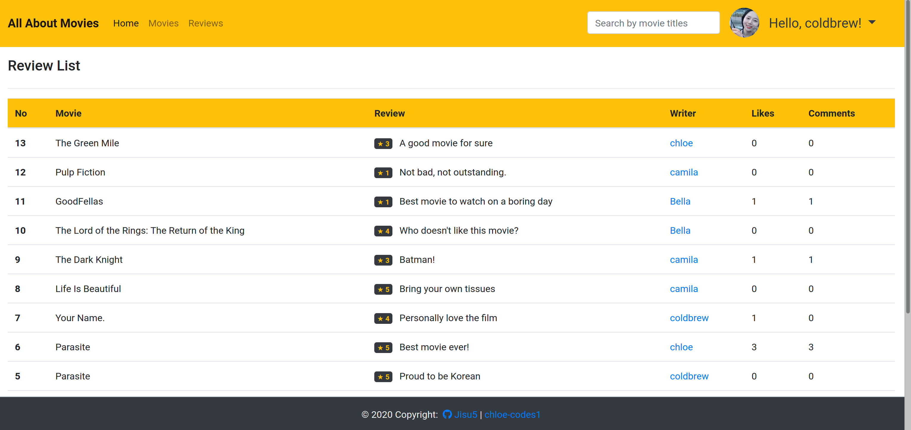
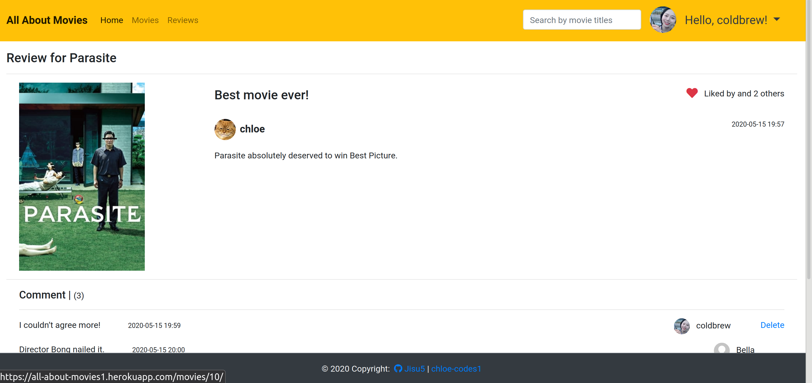
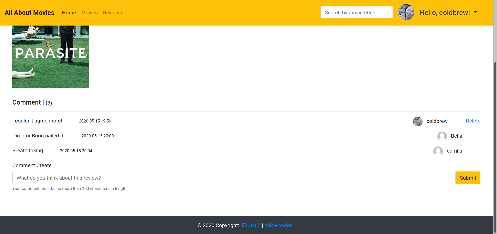

# All about movies

> An app for movie addicts

<br>

<br>

## Features

<br>

- #### Movie information

  - Provide movie information by using [The Movie Database API](https://developers.themoviedb.org/4/getting-started/authorization)
  - Top 3 movies (sorted by rating) 

- #### Movie reviews

  - CRUD
  - Image upload

- #### Comment

  - Comment on reviews

- #### Likes

  - Likes on reviews

- #### Follow

  - Follower / Following List

- #### Profile

  - Profile photo by using [gravatar](https://en.gravatar.com/)

- ### Search

  - Search by movie titles

<br>

<br>

## ERD

<br>



<br>

<br>


## Overview

<br>

> Main -1


<br>

> Main -2 


<br>

> Main -3


<br>

> Movie list


<br>

> Movie detail -1



<br>

> Movie detail -2



<br>

> Review list



<br>

> Review -1



<br> 

> Review -2



<br>

> Profile


<br>

> Follower


<br>

> Following


<br>

> Search by movie titles


<br>

<br>

<br>

`+`

## Deploying a Django project on Heroku

<br>

### 1. Modify `settings.py`

#### 1-1. Debug

```python
DEBUG = bool( os.environ.get('DJANGO_DEBUG', True))
```

<br>

#### 1-2. SECRET_KEY

```python
import os 
SECRET_KEY = os.environ.get('DJANGO_SECRET_KEY', 'YOUR_SECRET_KEY')
```

<br>

<br>

### 2. Install `Heroku` 

```bash
$ npm install -g heroku
```

<br>

<br>

### 3. Update the app for `Heroku`

#### 3-1. `Procfile`

```
web: gunicorn [YOUR_APP_NAME].wsgi --log-file -
```

- same directory as `manage.py`

<br>

#### 3-2. Install `Gunicorn`

> The Gunicorn "Green Unicorn" is a Python Web Server Gateway Interface HTTP server.

```bash
$ pip install gunicorn
```

<br>

#### 3-3. Database configuration

> **dj-database-url** (Django database configuration from environment variable)

```bash
$ pip install dj-database-url 
```

> Add it into the bottom of the `settings.py`

```python
# Heroku: Update database configuration from $DATABASE_URL.
import dj_database_url
db_from_env = dj_database_url.config(conn_max_age=500)
DATABASES['default'].update(db_from_env)
```

> **psycopg2** (Python Postgres database support)

```bash
$ pip install psycopg2-binary
```

<br>

#### 3-4. Serving static files in production

> Install `whitenoise`

```bash
$ pip install whitenoise
```

>  Add it into the MIDDLEWEAR of the `settings.py`

```python
MIDDLEWARE = [
    'whitenoise.middleware.WhiteNoiseMiddleware',
    'django.middleware.security.SecurityMiddleware',
    'django.contrib.sessions.middleware.SessionMiddleware',
    'django.middleware.common.CommonMiddleware',
    'django.middleware.csrf.CsrfViewMiddleware',
    'django.contrib.auth.middleware.AuthenticationMiddleware',
    'django.contrib.messages.middleware.MessageMiddleware',
    'django.middleware.clickjacking.XFrameOptionsMiddleware',
]
```

> Add it into the bottom of the `settings.py`

```python
# Static files (CSS, JavaScript, Images)
# https://docs.djangoproject.com/en/2.1/howto/static-files/

STATIC_URL = '/static/'

STATIC_ROOT = os.path.join(BASE_DIR, 'staticfiles')

STATICFILES_DIRS = [
    os.path.join(BASE_DIR, "static"),
]

STATICFILES_STORAGE = 'whitenoise.storage.CompressedManifestStaticFilesStorage'
```

<br>

#### 3-5. Requirements

> The Python requirements of your web application must be stored in a file **requirements.txt** in the root of your repository

```bash
$ pip freeze > requirements.txt
```

<br>

#### 3-6. Runtime

> `runtime.txt`  tells Heroku which programming language to use

```txt
python-3.6.9
```

<br>

<br>

### 4. Create and upload the website

<br>

#### 4-1. Create the app

```bash
$ heroku create [APP_NAME]
```

<br>

#### 4-2. Push our app to the Heroku repository

```bash
$ git add .
$ git commit
$ git push heroku master
```

<br>

#### 4-3. Set up the database tables

```bash
$ heroku run python manage.py migrate
```

<br>

#### 4-4. Create superuser

```bash
$ heroku run python manage.py createsuperuser
```

<br>

#### 4-5. Open your app

```bash
$ heroku open
```

<br>

<br>

### 5. You are now live!